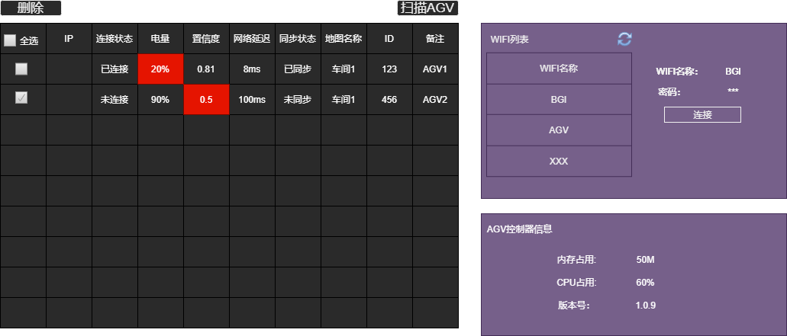
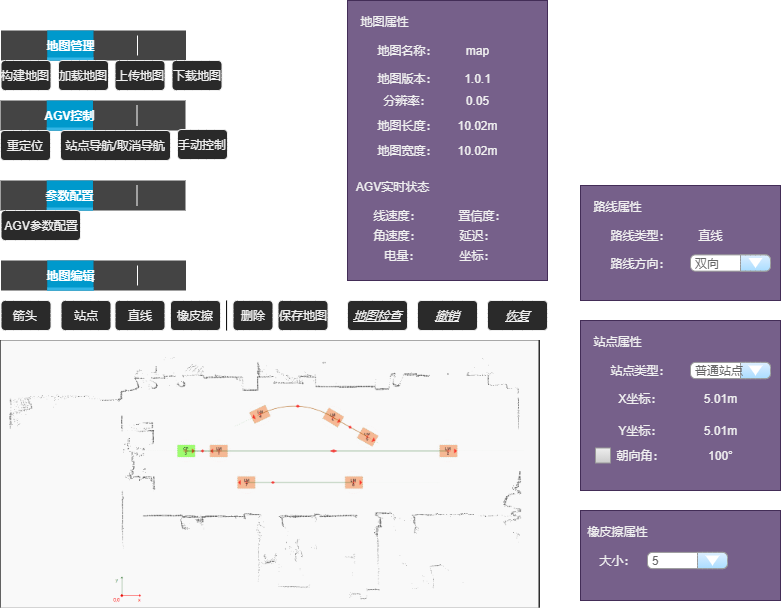

# 1. 软件层次结构

# 2. 主流程

# 3. 模块设计
## 3.1. 主框架设计
## 3.2. 菜单栏设计

## 3.3. AGV列表展示模块
- UI显示

- 删除  
删除选中的AGV。
- 扫描AGV  
广播扫描当前局域网中的AGV，并自动连接，连接成功添加列表显示，连接不成功写日志。如果列表中有则只修改连接状态。
- WIFI连接
- AGV控制器信息
- 【后续开发】批量更新AGV地图
- 【后续开发】批量更新AGV配置

## 3.4. AGV地图模块
双击列表某个AGV进入地图模块，加载本地地图进行显示。
### 3.4.1. UI显示

### 3.4.2. 地图管理
- 构建地图/构建完成
自动打开AGV手动控制窗口，地图显示切换为实时地图。（先不显示激光数据）。  
点击【构建完成】退出，并进行【地图已修改】弹窗。
- 加载地图  
从本地文件中加载一张地图。    
- 上传地图
- 下载地图
### 3.4.3. AGV控制
- 重定位
- 站点导航/取消导航
- 手动控制  
上、下、左、右。
### 3.4.4. 参数配置
- AGV参数配置（待完善）  
### 3.4.5. 地图编辑
离开该页面时需检测地图是否修改过，并进行【地图已修改】弹窗。
- 箭头  
- 站点  
- 直线  
- 贝塞尔曲线  
- 橡皮擦  
- 删除  
- 保存地图
- 撤销/回退      
- 【地图已修改】弹窗    
包含三个按钮：上传、下载、取消。
### 属性页
详见UI图片内容。

## 3.8. AGV充电模块

## 3.11. 通信模块
### 3.11.1. 通信设计
### 3.11.2. 通信协议
#### 3.11.2.1. 广播连接包
有线无线，统一广播地址255，255，255，255
包含的内容：
- 服务器IP地址
- 
#### 3.11.2.2. 连接某个AGV
#### 3.11.2.3. AGV实时信息
包括的内容：
- AGVID
- AGV位置、速度
- 实时激光数据
- 位置置信度
- AGV电量
- DWA局部路径

#### 3.11.2.4. 获取AGV扫描WIFI列表
#### 3.11.2.5. 连接某个WIFI
#### 3.11.2.6. AGV配置信息获取/下发
#### 3.11.2.7. 网格地图+拓扑地图下发
#### 3.11.2.8. 实时网格地图上报
#### 3.11.2.9. 目标站点下发
#### 3.11.2.10. AGV停止
#### 3.11.2.11. AGV定位
#### 3.11.2.12. AGV规划的路径
